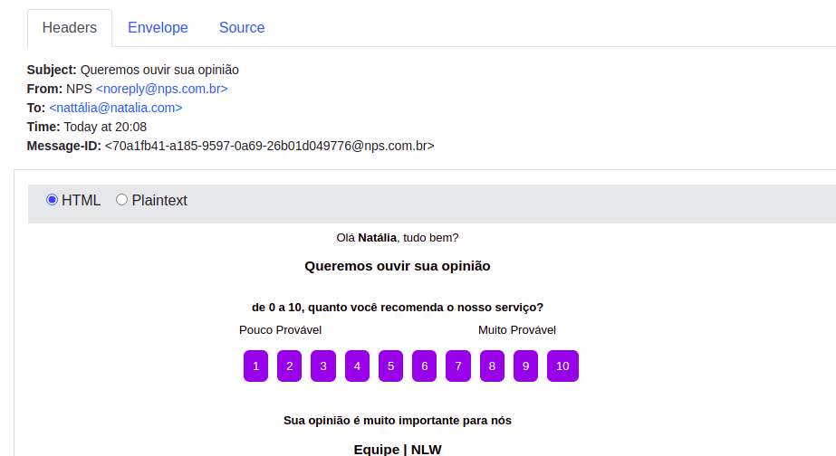

### NLW#4 - Trilha Node.js

 Essa API foi desenvolvida durante a Next Level Week 4, seguindo a trilha Node.js.   
A API consiste em um NPS (Net Promoter Score), ou seja, aquelas pesquisas de satisfação que são enviadas para os clientes por meio do email. Foram usadas várias tecnologias na api, como:
- [HandleBars](https://handlebarsjs.com),
- [TypeORM](https://typeorm.io/#/),
- [SQLite3](https://www.sqlite.org/index.html),
- [Nodemailer](https://nodemailer.com/about/),
- [Express](https://expressjs.com/pt-br/)

#### Essa foto é um envio de email:

<h1 align="center">

</h1>
 

Foi uma semana cheia de <strong>aprendizados</strong> e também de <strong>diversão</strong>, pois cada coisa nova que é aprendida dá uma alegria danada no coração 🥰
    
Esperando ansiosamente pela próxima NLW!
